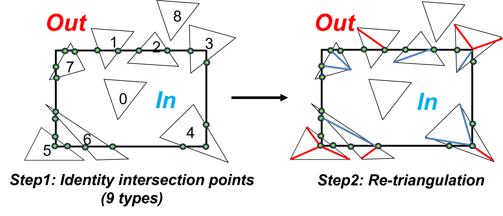

# Mesh Trimming

## Introduction
We are releasing our mesh editing tool as open-source software to facilitate efficient mesh trimming. Unlike existing tools like CloudCompare and Open3D, which simply remove triangles outside or inside AOi, leading a rough boundary, our tool takes a more precise approach. It carefully splits triangles that intersect with the AOI into smaller sub-triangles, ensuring a smooth clipping boundary. 

* Support cropping and keep the inside part or outside part mesh.
* Support multiple cropping at the same time. 
* Time complexity: O(N+k), where N is the number of triangles within the mesh and k is the number of triangles intersecting with the AOI.
* AOI format: rectangle. 

## Usage
```
Trimming.exe aoi_info.txt keep_aoi[0: keep inside part, 1:keep outside part]

crop_info_txt: each line contains seven elements including output_path, xmin, xmax, ymin, ymax, zmin, zmax
```


## Results
### Mesh Visualization


(a) Original mesh


(b) Mesh part inside the AOI


(c) Mesh part outside the AOI

## Topology visualization


(a) Original topology


(b) Cropped topology

## Process


(a) Overall pipeline


(b) Intersection types summary

## Contact:
Ningli Xu: xu.3961@buckeyemail.osu.edu , [website](https://ninglixu.github.io/)

